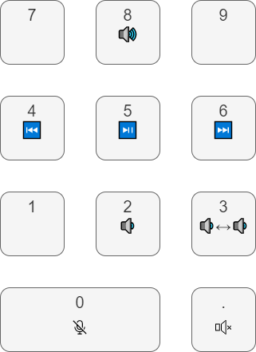

# AutoHotkey media controls numpad
Turn your numpad into controls for your media, when ScrollLock is enabled.

Includes features like volume control, pausing music and muting audio.

## Installation
1. Install AutoHotkey v1.1.33 from their website
2. Download 'extended_music_media_controls.ahk' from this page.
3. Run the file.
    - You can run the script by double clicking it.
    - To run the script with Windows-startup, put it in your startup directory.
4. Enable ScrollLock, and enjoy your media shortcuts!

## Hotkeys
- Numpad 5: play/pause 
- Numpad 6: next
- Numpad 4: previous
- Numpad 8: volume up 
- Numpad 2: volume down
- Numpad 0: mute/unmute microphone in Discord or MS Teams
- Numpad . : mute/unmute volume
- Numpad 3: switch to other speakers

Note: These hotkeys only work when ScrollLock is active. Otherwise the numpad keys have their normal functions.

The image above includes icons by [svgrepo.com](https://www.svgrepo.com/).

